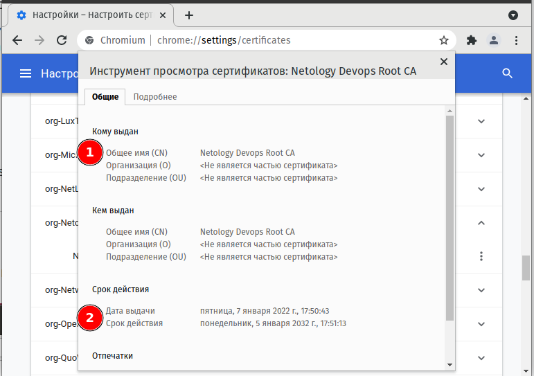
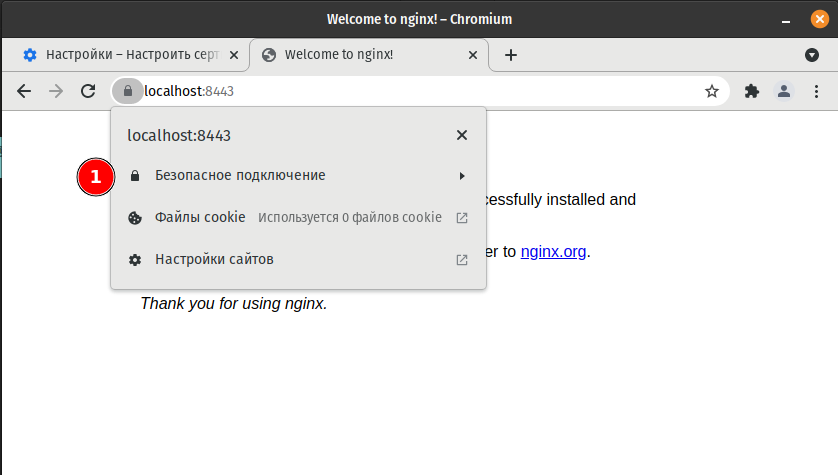

# Курсовая работа по итогам модуля "DevOps и системное администрирование"

Курсовая работа необходима для проверки практических навыков, полученных в ходе прохождения курса "DevOps и системное администрирование".

Мы создадим и настроим виртуальное рабочее место. Позже вы сможете использовать эту систему для выполнения домашних заданий по курсу

## Задание

1. **Создайте виртуальную машину Linux.**
```bash
>~/pcs-devsys-diplom/vagrant$ vagrant init bento/ubuntu-21.04

A `Vagrantfile` has been placed in this directory. You are now
ready to `vagrant up` your first virtual environment! Please read
the comments in the Vagrantfile as well as documentation on
`vagrantup.com` for more information on using Vagrant.
```

> `Vagrantfile` - добавлены параметры `forwarded_port` и `virtualbox.memory`:
```bash
 # сервис VAULT по умолчанию использует порт 8200 (+GUI)
 config.vm.network "forwarded_port", guest: 443, host: 8443
 # добавлена папка со скриптом для автоматического распечатывания VAULT
 config.vm.synced_folder "../unseals", "/vagrant_data"

 config.vm.provider "virtualbox" do |vb|
   vb.memory = "2048"
 end

```

```bash
>:~/pcs-devsys-diplom/vagrant$ vagrant up
>:~/pcs-devsys-diplom/vagrant$ vagrant ssh

Welcome to Ubuntu 21.04 (GNU/Linux 5.11.0-38-generic x86_64)
...
This system is built by the Bento project by Chef Software
More information can be found at https://github.com/chef/bento

```
> Зададим временную зону: `timedatectl set-timezone Europe/Moscow` ;

```bash
vagrant@vagrant:~$ free
              total        used        free      shared  buff/cache   available
Mem:        2025968      126060     1593504         956      306404     1749840
Swap:       1989628           0     1989628
```
```bash
vagrant@vagrant:~$ df -h
Filesystem                         Size  Used Avail Use% Mounted on
tmpfs                              198M  952K  197M   1% /run
/dev/mapper/ubuntu--vg-ubuntu--lv   31G  3.6G   26G  13% /
tmpfs                              990M     0  990M   0% /dev/shm
tmpfs                              5.0M     0  5.0M   0% /run/lock
tmpfs                              4.0M     0  4.0M   0% /sys/fs/cgroup
/dev/sda2                          976M   86M  823M  10% /boot
vagrant                            450G  319G  131G  72% /vagrant
tmpfs                              198M  4.0K  198M   1% /run/user/1000
```
```bash
vagrant@vagrant:~$ sudo apt install net-tools nmap

```

2. **Установите ufw и разрешите к этой машине сессии на порты 22 и 443, при этом трафик на интерфейсе localhost (lo) должен ходить свободно на все порты.**
```bash
vagrant@vagrant:~$ sudo apt install --reinstall ufw
...

vagrant@vagrant:~$ sudo ufw version
ufw 0.36
Copyright 2008-2015 Canonical Ltd.

vagrant@vagrant:~$ sudo ufw status
Status: inactive

```

```bash
vagrant@vagrant:~$ sudo ufw allow 22 && sudo ufw allow 443 && sudo ufw enable

Rules updated
Rules updated (v6)
Rules updated
Rules updated (v6)
Command may disrupt existing ssh connections. Proceed with operation (y|n)? y
Firewall is active and enabled on system startup

```
```bash
vagrant@vagrant:~$ sudo ufw status verbose
Status: active
Logging: on (low)
Default: deny (incoming), allow (outgoing), disabled (routed)
New profiles: skip

To                         Action      From
--                         ------      ----
22                         ALLOW IN    Anywhere                  
443                        ALLOW IN    Anywhere                  
22 (v6)                    ALLOW IN    Anywhere (v6)             
443 (v6)                   ALLOW IN    Anywhere (v6)    

```

3. **Установите hashicorp vault ([инструкция по ссылке](https://learn.hashicorp.com/tutorials/vault/getting-started-install?in=vault/getting-started#install-vault)).**

```bash
vagrant@vagrant:~$ curl -fsSL https://apt.releases.hashicorp.com/gpg | sudo apt-key add -
vagrant@vagrant:~$ sudo apt-add-repository "deb [arch=amd64] https://apt.releases.hashicorp.com $(lsb_release -cs) main"
vagrant@vagrant:~$ sudo apt-get update && sudo apt-get install vault jq


```


> Добавим установку hashicorp vault при первом запуске и автозапуск `vault server` (в DEV режиме) в `Vargantfile` :
```bash
  config.vm.provision "shell", inline: <<-SHELL
    curl -fsSL https://apt.releases.hashicorp.com/gpg | sudo apt-key add -
    sudo apt-add-repository "deb [arch=amd64] https://apt.releases.hashicorp.com $(lsb_release -cs) main
    sudo apt update 
    sudo apt install - y screen vault
    echo "VAULT_ADDR='http://127.0.0.1:8200'" >> /etc/environment
    echo "VAULT_TOKEN='root'" >> /etc/environment
    echo "" >> /var/log/vault.log
  SHELL
 
  config.vm.provision "shell", run: "always",  inline: <<-SHELL
     screen -dmS scr001 bash -c 'vault server -dev -dev-root-token-id root'; exec bash
  SHELL


```

**Проверка работы сервера `vault`:**
```bash
lsof -i:8200

COMMAND  PID  USER   FD   TYPE DEVICE SIZE/OFF NODE NAME
vault   6542 vault    8u  IPv4  55804      0t0  TCP *:8200 (LISTEN)

```
> Скриншот GUI управления VAULT (с хоста):


4. **Cоздайте центр сертификации по инструкции ([ссылка](https://learn.hashicorp.com/tutorials/vault/pki-engine?in=vault/secrets-management)) и выпустите сертификат для использования его в настройке веб-сервера nginx (срок жизни сертификата - месяц).**

> Устанавливаем системные переменные `VAULT_ADDR`, `VAULT_TOKEN`  и добавляем их в `/etc/environment`:

```bash
sudo export VAULT_ADDR=http://127.0.0.1:8200 && sudo echo 'VAULT_ADDR=http://127.0.0.1:8200' >> /etc/environment
sudo export VAULT_TOKEN=root && sudo echo 'VAULT_TOKEN=root' >> /etc/environment
```

> Проверяем статус `vault`:
```bash
sudo vault status

Key             Value
---             -----
Seal Type       shamir
Initialized     true
Sealed          false
Total Shares    1
Threshold       1
Version         1.9.2
Storage Type    inmem
Cluster Name    vault-cluster-a0611716
Cluster ID      c7b28335-a3de-2965-f91e-e6053bf05b4d
HA Enabled      false

``` 

> Залогинимся на сервер с помощью команды `vault login`
```bash
vault login root

Key                  Value
---                  -----
token                root
token_accessor       oM5f3Fc6ro0VKCC6bycOKIun
token_duration       ∞
token_renewable      false
token_policies       ["root"]
identity_policies    []
policies             ["root"]


```

> **Создаем корневой центр сертификации**, для этого последовательно выполняем следующий набор команд:

```bash
# Активируем PKI тип секрета для корневого центра сертификации
vault secrets enable pki

#Создаем корневой центр сертификации (CA) 10 лет и сохраняем корневой сертификат.
vault write -field=certificate pki/root/generate/internal \
     common_name="localnginx" \
     alt_names="localnginx" \
     ttl=87600h > CA_cert.crt

#Публикуем URL’ы для корневого центра сертификации
vault write pki/config/urls \
  issuing_certificates="$VAULT_ADDR/v1/pki/ca" \
  crl_distribution_points="$VAULT_ADDR/v1/pki/crl"

```

> **Создаем промежуточный центр сертификации**, для этого последовательно выполняем следующий набор команд:
```bash
#Активируем PKI тип секрета для промежуточного центра сертификации
vault secrets enable -path=pki_int pki
vault secrets tune -max-lease-ttl=43800h pki_int
#Генерируем запрос на выдачу сертификата для промежуточного центра сертификации
vault write -format=json pki_int/intermediate/generate/internal \
     common_name="localnginx" \
     alt_names="localnginx" \
     | jq -r '.data.csr' > pki_intermediate.csr
#Отправляем полученный CSR-файл в корневой центр сертификации, получаем сертификат для промежуточного центра сертификации (5лет)
vault write -format=json pki/root/sign-intermediate csr=@pki_intermediate.csr \
     format=pem_bundle ttl="43800h" \
     | jq -r '.data.certificate' > $pki_intermediate.cert.pem

#Публикуем подписанный сертификат промежуточного центра сертификации
vault write pki_int/intermediate/set-signed certificate=@pki_intermediate.cert.pem

```

> **Создаем роль для выдачи сертификатов**, для этого последовательно выполняем следующий набор команд:

```bash
#Создаем роль, с помощью которой будем выдавать сертификаты (макс 30 дней)
vault write pki_int/roles/example-dot-com \
     allow_bare_domains=true \
     allow_glob_domains=true \
     allow_localhost=true \
     allowed_domains="localhost" \
     allow_subdomains=true \
     max_ttl="730h"

```

> **Выпускаем сертификат для использования его в настройке веб-сервера nginx (срок жизни сертификата - месяц)**, для этого последовательно выполняем следующий набор команд:

```bash
#Создаем сертификат
vault write -format=json pki_int/issue/example-dot-com common_name="localhost" alt_names="localhost" ttl="730h" > test.example.com.crt

# Готовим для сервера NGINX Открытый(test.example.com.crt.pem) и Закрытый(test.example.com.crt.key) ключи
cat test.example.com.crt | jq -r .data.certificate > test.example.com.crt.pem
cat test.example.com.crt | jq -r .data.issuing_ca >> test.example.com.crt.pem
cat test.example.com.crt | jq -r .data.private_key > test.example.com.crt.key

```


> **Артефакты**: итоговый `Vargantfile` (запуск и развертывание `VM`), скрипты создания сертификатов, а также корневой, промежуточные сертификаты центра сертификации, серверверный сертификат и соотвествующие публичный и приватный ключи находятся в папке [vagrant_data](vagrant_data/).

5. **Установите корневой сертификат созданного центра сертификации в доверенные в хостовой системе.**

```bash
:/pcs-devsys-diplom/vagrant_data$ sudo cp CA_cert.crt /usr/local/share/ca-certificates
:/usr/local/share/ca-certificates$ sudo update-ca-certificates 

Updating certificates in /etc/ssl/certs...
1 added, 0 removed; done.
Running hooks in /etc/ca-certificates/update.d...

Adding debian:CA_cert.pem

```
> В браузере хостовой системы `CA_cert.crt` добавлен в доверенные центры сертификации:
> 


6. **Установите nginx.**

> Установка nginx выполнена с помощью команды `sudo apt install nginx`
> Добавляем в скрипт запуска службы `nginx.service` параметры защиты от остановки сервиса (`request repeated too quickly`):

```bash
[Service]
...
Restart=always
RestartSec=5


```

> Проверка работы службы выполнена с помощью команды `sudo systemctl status nginx`


```bash
● nginx.service - A high performance web server and a reverse proxy server
     Loaded: loaded (/lib/systemd/system/nginx.service; enabled; vendor preset: enabled)
     Active: active (running) since Fri 2022-01-07 21:01:37 MSK; 3min 36s ago
       Docs: man:nginx(8)
    Process: 2476 ExecStartPre=/usr/sbin/nginx -t -q -g daemon on; master_process on; (code=exited, status=0/SUCCESS)
    Process: 2477 ExecStart=/usr/sbin/nginx -g daemon on; master_process on; (code=exited, status=0/SUCCESS)
   Main PID: 2568 (nginx)
      Tasks: 3 (limit: 2298)
     Memory: 4.5M
     CGroup: /system.slice/nginx.service
             ├─2568 nginx: master process /usr/sbin/nginx -g daemon on; master_process on;
             ├─2571 nginx: worker process
             └─2572 nginx: worker process

Jan 07 21:01:37 vagrant systemd[1]: Starting A high performance web server and a reverse proxy server...
Jan 07 21:01:37 vagrant systemd[1]: Started A high performance web server and a reverse proxy server.

```
> В списке приложений, известных `ufw` появились профили `nginx`:
> `Nginx Full`, `Nginx HTTP`, `Nginx HTTPS`, которые открывают порты 80 и 443, только 80 или только 443 соотвественно. Порт 443 уже открыт.
>

7. **По инструкции ([ссылка](https://nginx.org/en/docs/http/configuring_https_servers.html)) настройте nginx на https, используя ранее подготовленный сертификат:**
  - **можно использовать стандартную стартовую страницу nginx для демонстрации работы сервера;**
  - **можно использовать и другой html файл, сделанный вами;**
> 
> Скриншот браузера на хосте:
> 
```bash
# Настроил nginx на использование подготовленного сертификата по протоколу https 
server {
        listen *:443 ssl;
        server_name localhost;
        ssl_certificate /vagrant_data/test.example.com.crt.pem;
        ssl_certificate_key /vagrant_data/test.example.com.crt.key;
        ssl_protocols  TLSv1 TLSv1.1 TLSv1.2;
        ssl_ciphers HIGH:!aNULL:!eNULL:!EXPORT:!CAMELLIA:!DES:!MD5:!PSK:!RC4;
        ssl_prefer_server_ciphers on;
      }

```

8. **Откройте в браузере на хосте https адрес страницы, которую обслуживает сервер nginx.**
>
> Скриншот браузера на хосте:
> 

9. **Создайте скрипт, который будет генерировать новый сертификат в vault:**
  - **генерируем новый сертификат так, чтобы не переписывать конфиг nginx;**

> Скрипт для генерации нового сертификата `nginx` (`touch nginx_cert_create01.sh && chmod +x ./nginx_cert_create01.sh`)  
```bash
#!/usr/bin/env bash
echo "$(date +%Y-%m-%d_%H:%M:%S%Z%z) [INFO] Запущен скрипт генерации сертификата" | sudo tee -a /var/log/vault.log

# Указываем полный путь к сертификату и параметр Срок до окончания действия сертификата = 5 дней  (120часов или 432000сек)
CERT_NAME="test.example.com.crt"
DAYS="30"
#Переходим в рабочий каталог `/vagrant_data`
cd /vagrant_data 

# Проверяем оставшийся срок жизни сертификата
echo "Текущий статус сертификата ${CERT_NAME}.pem:"
echo $(sudo openssl x509 -enddate -noout -in "/etc/nginx/conf.d/${CERT_NAME}.pem" -checkend $((DAYS*24*60*60)))
echo "==========="
echo "Останавливаем службу nginx"
sudo systemctl stop nginx
echo "Дата окончания действия сертификата ${CERT_NAME}.pem истекает - $(sudo openssl x509 -enddate -noout -in /etc/nginx/conf.d/${CERT_NAME}.pem)"
echo "==========="
echo "Создаем сертификат для nginx"
vault write -format=json pki_int/issue/example-dot-com common_name="localhost" alt_names="localhost" ttl="1d" > $CERT_NAME

# Готовим для сервера NGINX Открытый(test.example.com.crt.pem) и Закрытый(test.example.com.crt.key) ключи
cat $CERT_NAME | jq -r .data.certificate > "$CERT_NAME.pem"
cat $CERT_NAME | jq -r .data.issuing_ca >> "$CERT_NAME.pem"
cat $CERT_NAME | jq -r .data.private_key > "$CERT_NAME.key"

echo "Выпущен новый сертификат ${CERT_NAME}.pem  $(sudo openssl x509 -startdate -enddate -noout -in ${CERT_NAME}.pem)"
sudo cp "./$CERT_NAME.pem" /etc/nginx/conf.d/"$CERT_NAME.pem"
sudo cp "./$CERT_NAME.key" /etc/nginx/conf.d/"$CERT_NAME.key"
if (($?==0))
then
  echo "Новый сертификат скопирован в папку сертификатов nginx. Дата окончания действия сертификата ${CERT_NAME}.pem истекает - $(sudo openssl x509 -enddate -noout -in /etc/nginx/conf.d/${CERT_NAME}.pem)"
  echo "$(date +%Y-%m-%d_%H:%M:%S%Z%z) [INFO] Установлен новый сертификат ${CERT_NAME}.pem  $(sudo openssl x509 -serial -enddate -noout -in /etc/nginx/conf.d/${CERT_NAME}.pem)"  | tr '\n' ',' | sudo tee -a /var/log/vault.log
  echo "" | sudo tee -a /var/log/vault.log

else
  echo "Ошибка копирования нового сертификата"
  echo $(sudo openssl x509 -enddate -noout -in "${CERT_NAME}.pem" -checkend $((DAYS*24*60*60)))
  echo "$(date +%Y-%m-%d_%H:%M:%S%Z%z) [ERROR] Ошибка копирования нового сертификата ${CERT_NAME}.pem" | sudo tee -a /var/log/vault.log
fi
echo "==========="

sudo openssl x509 -enddate -noout -in "/etc/nginx/conf.d/${CERT_NAME}.pem"  -checkend "$((DAYS*24*60*60))" | grep "Certificate will expire"
if(($?==0))
then
  echo "ВНИМАНИЕ Дата окончания действия сертификата ${CERT_NAME}.pem менее чем через ${DAYS} дней "
  echo "$(date +%Y-%m-%d_%H:%M:%S%Z%z) [WARN] ВНИМАНИЕ Дата окончания действия сертификата ${CERT_NAME}.pem менее чем через ${DAYS} дней $(sudo openssl x509 -serial -enddate -noout -in /etc/nginx/conf.d/${CERT_NAME}.pem)"  | tr '\n' ',' | sudo tee -a /var/log/vault.log
  echo "" | sudo tee -a /var/log/vault.log
else
  echo "Дата окончания действия сертификата ${CERT_NAME}.pem более чем через ${DAYS} дней "
fi
# Перезапускаем сервера `nginx`
echo "Перезапускаем службу nginx"
sudo systemctl restart nginx

```


10. **Поместите скрипт в crontab, чтобы сертификат обновлялся какого-то числа каждого месяца в удобное для вас время.**

> Открыть расписание пользователя root: `sudo crontab -e`
> Добавить строку `40 2 1/5 * * /vagrant_data/nginx_cert_create01.sh` (Запускать скрипт обновления сертификата каждые пять дней с 1-го по 31-е число каждый месяц в 2:40)
> Сохранить изменения и закрыть редактор
> Для проверки работы планировщика установил следующее правило - `*/3 * * * * bash /vagrant_data/nginx_cert_create01.sh` (запуск скрипта генерации сертификата каждые 3 минуты)
```bash
# Планировщик запускает скрипт каждые 3 минуты
root@vagrant:/var/log# grep nginx_cert_create /var/log/syslog
Jan 11 17:54:01 vagrant CRON[2800]: (root) CMD (bash /vagrant_data/nginx_cert_create01.sh)
Jan 11 17:57:01 vagrant CRON[1712]: (root) CMD (bash /vagrant_data/nginx_cert_create01.sh)
Jan 11 18:00:01 vagrant CRON[1774]: (root) CMD (bash /vagrant_data/nginx_cert_create01.sh)
Jan 11 18:03:01 vagrant CRON[1836]: (root) CMD (bash /vagrant_data/nginx_cert_create01.sh)
Jan 11 18:06:01 vagrant CRON[1895]: (root) CMD (bash /vagrant_data/nginx_cert_create01.sh)

```
```bash
# Результат выполнения скрипта фиксируется в лог-файле каждые 3 минуты
root@vagrant:/var/log# cat /var/log/vault.log

2022-01-11_17:54:02MSK+0300 [INFO] Запущен скрипт генерации сертификата
2022-01-11_17:54:02MSK+0300 [INFO] Установлен новый сертификат test.example.com.crt.pem  serial=8EF132C6FF50DE0DE42E96107710EC9FD1CA05,notAfter=Jan 12 14:54:02 2022 GMT,
2022-01-11_17:54:02MSK+0300 [WARN] ВНИМАНИЕ Дата окончания действия сертификата test.example.com.crt.pem менее чем через 30 дней serial=8EF132C6FF50DE0DE42E96107710EC9FD1CA05,notAfter=Jan 12 14:54:02 2022 GMT
2022-01-11_17:57:02MSK+0300 [INFO] Запущен скрипт генерации сертификата
2022-01-11_17:57:02MSK+0300 [INFO] Установлен новый сертификат test.example.com.crt.pem  serial=2293414CF57013A50ECA90196970A8AFF11E7899,notAfter=Jan 12 14:57:02 2022 GMT,
2022-01-11_17:57:02MSK+0300 [WARN] ВНИМАНИЕ Дата окончания действия сертификата test.example.com.crt.pem менее чем через 30 дней serial=2293414CF57013A50ECA90196970A8AFF11E7899,notAfter=Jan 12 14:57:02 2022 GMT,
2022-01-11_18:00:02MSK+0300 [INFO] Запущен скрипт генерации сертификата
2022-01-11_18:00:02MSK+0300 [INFO] Установлен новый сертификат test.example.com.crt.pem  serial=5F86116A82C228204E55DBBC570A5F2F6AFCB0FA,notAfter=Jan 12 15:00:01 2022 GMT,
2022-01-11_18:00:02MSK+0300 [WARN] ВНИМАНИЕ Дата окончания действия сертификата test.example.com.crt.pem менее чем через 30 дней serial=5F86116A82C228204E55DBBC570A5F2F6AFCB0FA,notAfter=Jan 12 15:00:01 2022 GMT,
2022-01-11_18:03:01MSK+0300 [INFO] Запущен скрипт генерации сертификата
2022-01-11_18:03:01MSK+0300 [INFO] Установлен новый сертификат test.example.com.crt.pem  serial=163FA43BB38F88BA76FFA9BED2A72BB01F950AE0,notAfter=Jan 12 15:03:01 2022 GMT,
2022-01-11_18:03:01MSK+0300 [WARN] ВНИМАНИЕ Дата окончания действия сертификата test.example.com.crt.pem менее чем через 30 дней serial=163FA43BB38F88BA76FFA9BED2A72BB01F950AE0,notAfter=Jan 12 15:03:01 2022 GMT,
2022-01-11_18:06:01MSK+0300 [INFO] Запущен скрипт генерации сертификата
2022-01-11_18:06:01MSK+0300 [INFO] Установлен новый сертификат test.example.com.crt.pem  serial=4E8C0991BF45033DB05F8E93957AE1C504B88422,notAfter=Jan 12 15:06:01 2022 GMT,
2022-01-11_18:06:01MSK+0300 [WARN] ВНИМАНИЕ Дата окончания действия сертификата test.example.com.crt.pem менее чем через 30 дней serial=4E8C0991BF45033DB05F8E93957AE1C504B88422,notAfter=Jan 12 15:06:01 2022 GMT,


```

===

## Результат

Результатом курсовой работы должны быть снимки экрана или текст:

- Процесс установки и настройки ufw
- Процесс установки и выпуска сертификата с помощью hashicorp vault
- Процесс установки и настройки сервера nginx
- Страница сервера nginx в браузере хоста не содержит предупреждений 
- Скрипт генерации нового сертификата работает (сертификат сервера ngnix должен быть "зеленым")
- Crontab работает (выберите число и время так, чтобы показать что crontab запускается и делает что надо)

## Как сдавать курсовую работу

Курсовую работу выполните в файле readme.md в github репозитории. В личном кабинете отправьте на проверку ссылку на .md-файл в вашем репозитории.

Также вы можете выполнить задание в [Google Docs](https://docs.google.com/document/u/0/?tgif=d) и отправить в личном кабинете на проверку ссылку на ваш документ.
Если необходимо прикрепить дополнительные ссылки, просто добавьте их в свой Google Docs.

Перед тем как выслать ссылку, убедитесь, что ее содержимое не является приватным (открыто на комментирование всем, у кого есть ссылка), иначе преподаватель не сможет проверить работу. 
Ссылка на инструкцию [Как предоставить доступ к файлам и папкам на Google Диске](https://support.google.com/docs/answer/2494822?hl=ru&co=GENIE.Platform%3DDesktop).
