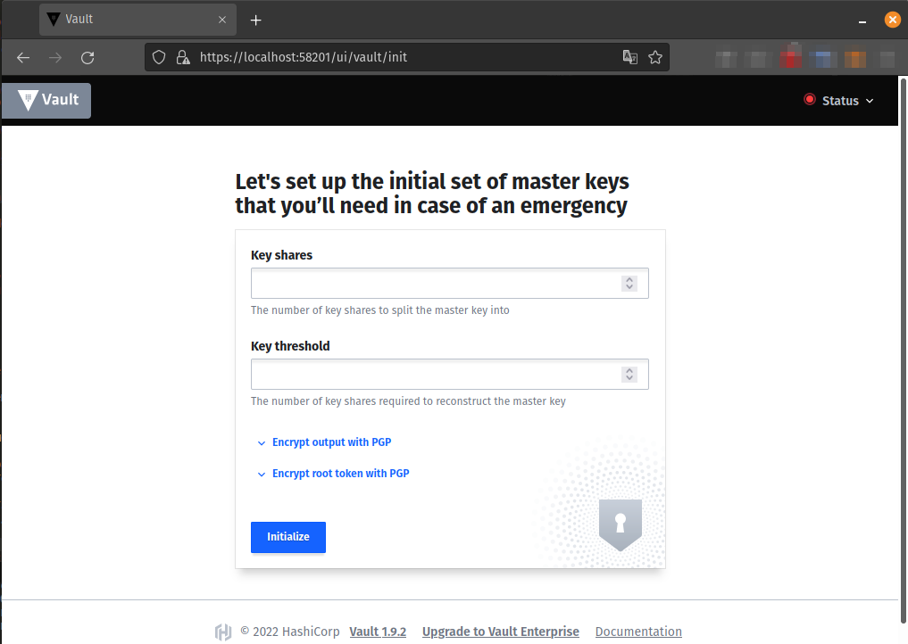

# Курсовая работа по итогам модуля "DevOps и системное администрирование"

Курсовая работа необходима для проверки практических навыков, полученных в ходе прохождения курса "DevOps и системное администрирование".

Мы создадим и настроим виртуальное рабочее место. Позже вы сможете использовать эту систему для выполнения домашних заданий по курсу

## Задание

1. **Создайте виртуальную машину Linux.**
```bash
>~/pcs-devsys-diplom/vagrant$ vagrant init bento/ubuntu-21.04

A `Vagrantfile` has been placed in this directory. You are now
ready to `vagrant up` your first virtual environment! Please read
the comments in the Vagrantfile as well as documentation on
`vagrantup.com` for more information on using Vagrant.
```

> `Vagrantfile` - добавлены параметры `forwarded_port` и `virtualbox.memory`:
```bash
 # сервис VAULT по умолчанию использует порт 8200 (+GUI)
 config.vm.network "forwarded_port", guest: 8200, host: 58201
 # добавлена папка со скриптом для автоматического распечатывания VAULT
 config.vm.synced_folder "../unseals", "/vagrant_data"


 config.vm.provider "virtualbox" do |vb|
   vb.memory = "2048"
 end

```
```bash
>:~/pcs-devsys-diplom/vagrant$ vagrant up
>:~/pcs-devsys-diplom/vagrant$ vagrant ssh

Welcome to Ubuntu 21.04 (GNU/Linux 5.11.0-38-generic x86_64)
...
This system is built by the Bento project by Chef Software
More information can be found at https://github.com/chef/bento

```
> Зададим временную зону: `timedatectl set-timezone Europe/Moscow` ;

```bash
vagrant@vagrant:~$ free
              total        used        free      shared  buff/cache   available
Mem:        2025968      126060     1593504         956      306404     1749840
Swap:       1989628           0     1989628
```
```bash
vagrant@vagrant:~$ df -h
Filesystem                         Size  Used Avail Use% Mounted on
tmpfs                              198M  952K  197M   1% /run
/dev/mapper/ubuntu--vg-ubuntu--lv   31G  3.6G   26G  13% /
tmpfs                              990M     0  990M   0% /dev/shm
tmpfs                              5.0M     0  5.0M   0% /run/lock
tmpfs                              4.0M     0  4.0M   0% /sys/fs/cgroup
/dev/sda2                          976M   86M  823M  10% /boot
vagrant                            450G  319G  131G  72% /vagrant
tmpfs                              198M  4.0K  198M   1% /run/user/1000
```
```bash
vagrant@vagrant:~$ sudo apt install net-tools nmap

```

2. **Установите ufw и разрешите к этой машине сессии на порты 22 и 443, при этом трафик на интерфейсе localhost (lo) должен ходить свободно на все порты.**
```bash
vagrant@vagrant:~$ sudo apt install --reinstall ufw
...

vagrant@vagrant:~$ sudo ufw version
ufw 0.36
Copyright 2008-2015 Canonical Ltd.

vagrant@vagrant:~$ sudo ufw status
Status: inactive

```

```bash
vagrant@vagrant:~$ sudo ufw allow 22 && sudo ufw allow 443 && sudo ufw enable

Rules updated
Rules updated (v6)
Rules updated
Rules updated (v6)
Command may disrupt existing ssh connections. Proceed with operation (y|n)? y
Firewall is active and enabled on system startup

```
```bash
vagrant@vagrant:~$ sudo ufw status verbose
Status: active
Logging: on (low)
Default: deny (incoming), allow (outgoing), disabled (routed)
New profiles: skip

To                         Action      From
--                         ------      ----
22                         ALLOW IN    Anywhere                  
443                        ALLOW IN    Anywhere                  
22 (v6)                    ALLOW IN    Anywhere (v6)             
443 (v6)                   ALLOW IN    Anywhere (v6)    

```

3. **Установите hashicorp vault ([инструкция по ссылке](https://learn.hashicorp.com/tutorials/vault/getting-started-install?in=vault/getting-started#install-vault)).**

```bash
vagrant@vagrant:~$ curl -fsSL https://apt.releases.hashicorp.com/gpg | sudo apt-key add -

vagrant@vagrant:~$ sudo apt-add-repository "deb [arch=amd64] https://apt.releases.hashicorp.com $(lsb_release -cs) main"

vagrant@vagrant:~$ sudo apt-get update && sudo apt-get install vault jq


```


> Разрешаем запуск службы `systemctl enable vault --now` ;

```bash
lsof -i:8200

COMMAND  PID  USER   FD   TYPE DEVICE SIZE/OFF NODE NAME
vault   6542 vault    8u  IPv4  55804      0t0  TCP *:8200 (LISTEN)

ufw allow 8200 && ufw enable # на время установки разрешаем доступ извне к GUI VAULT
```
> Скриншот GUI управления VAULT (с хоста):


4. **Cоздайте центр сертификации по инструкции ([ссылка](https://learn.hashicorp.com/tutorials/vault/pki-engine?in=vault/secrets-management)) и выпустите сертификат для использования его в настройке веб-сервера nginx (срок жизни сертификата - месяц).**

> Изменим настройки запуска VAULT: отключим `https` и включим `http` локально на том же порту:
> `nano /etc/vault.d/vault.hcl`

```bash

# HTTP listener
listener "tcp" {
  address = "127.0.0.1:8200"
  tls_disable = 1
}

# HTTPS listener
#listener "tcp" {
#  address       = "0.0.0.0:8200"
#  tls_cert_file = "/opt/vault/tls/tls.crt"
#  tls_key_file  = "/opt/vault/tls/tls.key"
#}


```

> Устанавливаем системную переменную `VAULT_ADDR`  и добавляем ее в `/etc/environment`:


```bash
sudo export VAULT_ADDR=http://127.0.0.1:8200 && sudo echo 'VAULT_ADDR=http://127.0.0.1:8200' >> /etc/environment
```

> Перезапускаем `VAULT` и проверяем статус:
```bash
sudo systemctl restart vault
sudo vault status

Key                Value
---                -----
Seal Type          shamir
Initialized        false
Sealed             true
Total Shares       0
Threshold          0
Unseal Progress    0/0
Unseal Nonce       n/a
Version            1.9.2
Storage Type       file
HA Enabled         false

``` 
> После установки сервер Vault находится в запечатанном (sealed) состоянии `Sealed = true` :
> сервер не сможет расшифровывать секреты, которые будут храниться в базе.
> Любые операции с хранилищем секретов приведут к ошибке.

> Выполним инициализацию сервера `VAULT`:
```bash
vault operator init

Unseal Key 1: lJnqy8M4Yb48LkKGv3IVXlYcgr15AlrHke8NZGc/o6ms
Unseal Key 2: +w4aNtjjaAvt0/zUXu2hT059czyGgbxnegQ3DzCoyNHq
Unseal Key 3: MFHYjEWQU7thWn2xF5eytEGjI+GTxtfM79NIzy3hF8br 
Unseal Key 4: EQv7NiBKR1H2ZkLjZBi/I6Yx5J+oKzDoE6E0SmVrrwn6
Unseal Key 5: vmFuzD6F15KupD+Kn363AuR1aQyzR/wcXmNR/2g+XKeW

Initial Root Token: s.ZWfxRLYkkVmnmIaxAJLGBBcW 

Vault initialized with 5 key shares and a key threshold of 3. Please securely
distribute the key shares printed above. When the Vault is re-sealed,
restarted, or stopped, you must supply at least 3 of these keys to unseal it
before it can start servicing requests.

Vault does not store the generated master key. Without at least 3 keys to
reconstruct the master key, Vault will remain permanently sealed!

It is possible to generate new unseal keys, provided you have a quorum of
existing unseal keys shares. See "vault operator rekey" for more information.

```
> Залогинимся на сервер с помощью команды `vault login` и укажем значение `Initial Root Token`
```bash
Key                  Value
---                  -----
token                s.ZWfxRLYkkVmnmIaxAJLGBBcW
token_accessor       MctQfy2yLajIapxWcOBKuSOm
token_duration       ∞
token_renewable      false
token_policies       ["root"]
identity_policies    []
policies             ["root"]

```
> Настроим скрипт "распечатывания", для этого в папке `/vagrant_data` создадим файл `touch security.sh && chmod +x security.sh`, со следующим содержимым:
```bash
#!/usr/bin/env bash

UnsealKey1=lJnqy8M4Yb48LkKGv3IVXlYcgr15AlrHke8NZGc/o6ms
UnsealKey2=+w4aNtjjaAvt0/zUXu2hT059czyGgbxnegQ3DzCoyNHq
UnsealKey3=MFHYjEWQU7thWn2xF5eytEGjI+GTxtfM79NIzy3hF8br 
UnsealKey4=EQv7NiBKR1H2ZkLjZBi/I6Yx5J+oKzDoE6E0SmVrrwn6
UnsealKey5=vmFuzD6F15KupD+Kn363AuR1aQyzR/wcXmNR/2g+XKeW

InitialRootToken=s.ZWfxRLYkkVmnmIaxAJLGBBcW

sleep 10
vault operator unseal $UnsealKey1
vault operator unseal $UnsealKey2
vault operator unseal $UnsealKey3
```
> Запустим скрипт и распечатаем сервер VAULT: `Sealed = false`

> **Создаем корневой центр сертификации**, для этого последовательно выполняем следующий набор команд:

```bash
# Включаем pki 
vault secrets enable pki
# Включаем "Максимальное время жизни сертификата" - 10 лет для pki
vault secrets tune -max-lease-ttl=87600h pki
# Генерируем root сертификат и сохраняем его в CA_cert.crt 
vault write -field=certificate pki/root/generate/internal \
    common_name="Netology Devops Root CA" \
    ttl=87600h > CA_cert.crt

```

> Добавляем параметры "Адреса корневого центра сертификации":  
```bash
vault write pki/config/urls \
    issuing_certificates="$VAULT_ADDR/v1/pki/ca" \
    crl_distribution_points="$VAULT_ADDR/v1/pki/crl"

```
> **Создаем промежуточный центр сертификации**, для этого последовательно выполняем следующий набор команд:
```bash
# Включаем pki 
vault secrets enable -path=pki_int pki
# Включаем "Максимальное время жизни сертификата" - 5 лет для pki
vault secrets tune -max-lease-ttl=43800h pki_int
# Генерируем промежуточный сертификат и сохраняем его в pki_intermediate.csr
vault write -format=json pki_int/intermediate/generate/internal \
    common_name="Netology Devops Intermediate Auth" \
    | jq -r '.data.csr' > pki_intermediate.csr
# Подписываем промежуточный сертификат закрытым ключом корневого ЦС и сохраняем в intermediate.cert.pem
vault write -format=json pki/root/sign-intermediate csr=@pki_intermediate.csr \
     format=pem_bundle ttl="43800h" \
     | jq -r '.data.certificate' > intermediate.cert.pem
# После подписания промежуточного сертификата публикуем его в VAULT
vault write pki_int/intermediate/set-signed certificate=@intermediate.cert.pem

```

> **Создаем роль для выдачи серверных сертификатов**, для этого последовательно выполняем следующий набор команд:
```bash
# Создаем роль `nginx-local-host`, которая разрешает выпуск серверного сертификата для `localhost` (срок жизни сертификата - месяц) 
vault write pki_int/roles/nginx-local-host \
     require_cn=false \
     allow_localhost=true \
     server_flag=true \
     client_flag=false \
     ou="DEV" \
     organization="Netology" \
     max_ttl="730h"

```
> **Выпускаем сертификат для использования его в настройке веб-сервера nginx (срок жизни сертификата - месяц)**, для этого последовательно выполняем следующий набор команд:
```bash
# Генерируем сертификат - срок жизни месяц (30 дней)
vault write -format=json pki_int/issue/nginx-local-host \
    ttl="720h" > vault.netology.ru.crt 
# Сохраняем сертификат в формате public/private key
cat vault.netology.ru.crt | jq -r .data.certificate > vault.netology.ru.crt.pem
cat vault.netology.ru.crt | jq -r .data.issuing_ca >> vault.netology.ru.crt.pem
cat vault.netology.ru.crt | jq -r .data.private_key > vault.netology.ru.crt.key

```
> Артефакты скрипт распечатывания, корневой, промежуточные сертификаты центра сертификации, а также серверный сертификат и соотвествующие публичный и приватный ключи находятся в папке [vagrant_data](vagrant_data/README.md).

5. **Установите корневой сертификат созданного центра сертификации в доверенные в хостовой системе.**


6. **Установите nginx.**


7. **По инструкции ([ссылка](https://nginx.org/en/docs/http/configuring_https_servers.html)) настройте nginx на https, используя ранее подготовленный сертификат:**
  - **можно использовать стандартную стартовую страницу nginx для демонстрации работы сервера;**
  - **можно использовать и другой html файл, сделанный вами;**


8. **Откройте в браузере на хосте https адрес страницы, которую обслуживает сервер nginx.**
9. **Создайте скрипт, который будет генерировать новый сертификат в vault:**
  - **генерируем новый сертификат так, чтобы не переписывать конфиг nginx;**
  - **перезапускаем nginx для применения нового сертификата.**


10. **Поместите скрипт в crontab, чтобы сертификат обновлялся какого-то числа каждого месяца в удобное для вас время.**


## Результат

Результатом курсовой работы должны быть снимки экрана или текст:

- Процесс установки и настройки ufw
- Процесс установки и выпуска сертификата с помощью hashicorp vault
- Процесс установки и настройки сервера nginx
- Страница сервера nginx в браузере хоста не содержит предупреждений 
- Скрипт генерации нового сертификата работает (сертификат сервера ngnix должен быть "зеленым")
- Crontab работает (выберите число и время так, чтобы показать что crontab запускается и делает что надо)

## Как сдавать курсовую работу

Курсовую работу выполните в файле readme.md в github репозитории. В личном кабинете отправьте на проверку ссылку на .md-файл в вашем репозитории.

Также вы можете выполнить задание в [Google Docs](https://docs.google.com/document/u/0/?tgif=d) и отправить в личном кабинете на проверку ссылку на ваш документ.
Если необходимо прикрепить дополнительные ссылки, просто добавьте их в свой Google Docs.

Перед тем как выслать ссылку, убедитесь, что ее содержимое не является приватным (открыто на комментирование всем, у кого есть ссылка), иначе преподаватель не сможет проверить работу. 
Ссылка на инструкцию [Как предоставить доступ к файлам и папкам на Google Диске](https://support.google.com/docs/answer/2494822?hl=ru&co=GENIE.Platform%3DDesktop).
